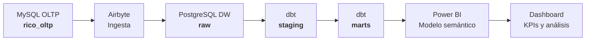
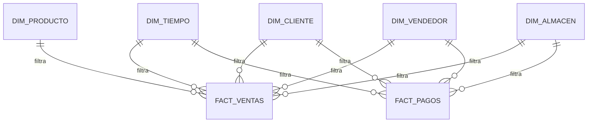
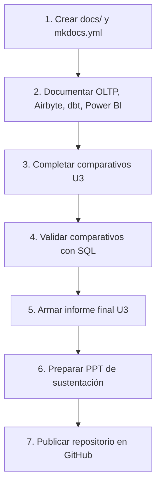

<div align="center">

# 🐔 Rico BI  
### Solución BI end-to-end para Corporación Rico S.A.C.

**Ventas · Rentabilidad · Clientes · Vendedores · Cobranza**


## 🔗 Enlaces del producto

| Recurso | Enlace |
|---|---|
| Repositorio GitHub | https://github.com/EliasDemo/rico-bi |
| Documentación MkDocs | https://EliasDemo.github.io/rico-bi/ |
| Dashboard Power BI | `powerbi/rico_pollo_actualizado.pbix` |
<br>


<br>

> Proyecto académico orientado a construir una solución BI completa, trazable y validada desde una fuente transaccional hasta un dashboard ejecutivo en Power BI.

</div>

---

## 📌 Vista rápida del proyecto

| Bloque | Descripción |
|---|---|
| **Proyecto** | Rico BI |
| **Empresa analizada** | Corporación Rico S.A.C. |
| **Proceso de negocio** | Ventas, productos, clientes, vendedores, almacén y cobranza |
| **Fuente transaccional** | MySQL OLTP `rico_oltp` |
| **Data Warehouse / DataMart** | PostgreSQL `rico_dw` con esquemas `raw`, `staging` y `marts` |
| **Transformación** | dbt |
| **Visualización** | Power BI |
| **Entregable** | Unidad 3: producto BI end-to-end |

---

## 🧭 Índice

- [1. Resumen ejecutivo](#1-resumen-ejecutivo)
- [2. Problema de negocio](#2-problema-de-negocio)
- [3. Objetivo analítico](#3-objetivo-analítico)
- [4. Arquitectura BI](#4-arquitectura-bi)
- [5. Stack tecnológico](#5-stack-tecnológico)
- [6. Estructura del repositorio](#6-estructura-del-repositorio)
- [7. Modelo dimensional](#7-modelo-dimensional)
- [8. KPIs principales](#8-kpis-principales)
- [9. Resultados validados](#9-resultados-validados)
- [10. Dashboard Power BI](#10-dashboard-power-bi)
- [11. Ejecución rápida](#11-ejecución-rápida)
- [12. Validación y calidad de datos](#12-validación-y-calidad-de-datos)
- [13. Evidencias U3](#13-evidencias-u3)
- [14. Integrantes](#14-integrantes)
- [15. Próximos pasos](#15-próximos-pasos)

---

## 1. Resumen ejecutivo

**Rico BI** es una solución de Business Intelligence construida para integrar, transformar, validar y visualizar información comercial y financiera de Corporación Rico S.A.C.

La solución permite analizar:

- ventas facturadas;
- ventas netas sin IGV;
- margen bruto;
- rentabilidad por producto y categoría;
- rendimiento de vendedores;
- clientes principales;
- saldo pendiente de cobranza;
- eficiencia de cobro;
- evolución temporal de ventas.

El flujo implementado es:

```text
MySQL OLTP → Airbyte → PostgreSQL RAW → dbt STAGING → dbt MARTS → Power BI
```

También se conserva una versión manual del Data Warehouse en MySQL para evidenciar el diseño físico de dimensiones y hechos mediante SQL.

---

## 2. Problema de negocio

Corporación Rico S.A.C. necesita una vista analítica integrada para responder preguntas comerciales y financieras que no se resuelven eficientemente desde la base transaccional.

### Preguntas de negocio

| Pregunta | Decisión que permite tomar |
|---|---|
| ¿Qué productos generan mayor venta y margen? | Priorizar productos rentables |
| ¿Qué clientes concentran mayor facturación? | Gestionar clientes estratégicos |
| ¿Qué vendedores tienen mejor rendimiento? | Evaluar desempeño comercial |
| ¿Cuál es la cartera pendiente? | Gestionar cobranza |
| ¿Cómo evolucionan las ventas por periodo? | Detectar tendencias y estacionalidad |
| ¿Qué categorías tienen mayor participación? | Ajustar estrategia comercial |

---

## 3. Objetivo analítico

Construir una solución BI end-to-end que permita analizar el desempeño comercial, la rentabilidad y la cobranza mediante KPIs confiables, trazables y validados entre SQL, DataMart y Power BI.

---

## 4. Arquitectura BI

### 4.1 Flujo general



### 4.2 Capas de datos

| Capa | Equivalencia | Propósito | Herramienta |
|---|---|---|---|
| **OLTP** | Sistema origen | Registro transaccional de ventas y pagos | MySQL |
| **RAW** | Bronze | Réplica cruda desde el origen | Airbyte + PostgreSQL |
| **STAGING** | Silver | Limpieza, renombrado y estandarización | dbt |
| **MARTS** | Gold | Modelo dimensional para análisis | dbt + PostgreSQL |
| **SEMÁNTICA** | BI Model | Relaciones, jerarquías y medidas | Power BI |
| **DASHBOARD** | Consumo | Visualización para toma de decisiones | Power BI |

---

## 5. Stack tecnológico

| Componente | Tecnología | Rol en el proyecto |
|---|---|---|
| Base transaccional | MySQL 8.4 | Fuente OLTP |
| Contenedores | Docker / Docker Compose | Aislamiento de servicios |
| Ingesta | Airbyte local con `abctl` | Replicación OLTP → RAW |
| Data Warehouse | PostgreSQL 16 | Base analítica |
| Transformación | dbt + dbt-postgres | Staging, marts y pruebas |
| Modelo semántico | Power BI Desktop | Relaciones y medidas DAX |
| Visualización | Power BI | Dashboard ejecutivo |
| Validación | SQL + dbt test + Power BI | Control de calidad y consistencia |

---

## 6. Estructura del repositorio

```text
rico-bi
├── README.md
├── .gitignore
├── oltp-mysql
│   ├── docker-compose.yml
│   ├── 01_rico_oltp_completo.sql
│   └── 02_validar_rico_oltp.sql
├── dw-mysql
│   ├── 03_crear_dw_rico.sql
│   ├── 04_cargar_dimensiones.sql
│   ├── 05_cargar_hechos.sql
│   └── 06_validar_dw_rico.sql
├── dw-pg
│   ├── docker-compose.yml
│   ├── 01_init_dw_pg.sql
│   └── 02_crear_raw_tables.sql
├── ingesta-airbyte
│   └── evidencias_configuracion_airbyte.md
├── dw-dbt
│   ├── docker-compose.yml
│   ├── Dockerfile
│   ├── requirements.txt
│   ├── profiles
│   │   └── profiles.yml
│   └── rico_bi
│       └── rico_bi
│           ├── dbt_project.yml
│           ├── models
│           │   ├── staging
│           │   └── marts
│           ├── analyses
│           │   └── validacion_marts.sql
│           └── macros
├── powerbi
│   └── rico_pollo_actualizado.pbix
└── docs
    ├── index.md
    ├── oltp.md
    ├── airbyte.md
    ├── dbt.md
    ├── datamart.md
    ├── powerbi.md
    ├── validacion.md
    └── sustentacion.md
```

> **Nota:** la carpeta `docs/` corresponde a la documentación MkDocs del producto U3. Si todavía no existe, debe crearse en el siguiente paso.

---

## 7. Modelo dimensional

### 7.1 Esquema estrella



### 7.2 Dimensiones

| Tabla | Descripción | Uso analítico |
|---|---|---|
| `dim_tiempo` | Calendario analítico | Evolución, MoM, YoY |
| `dim_cliente` | Cliente, tipo y ubicación | Top clientes, segmentación |
| `dim_producto` | Producto, categoría, precios y stock | Rentabilidad y participación |
| `dim_vendedor` | Vendedor y zona comercial | Desempeño de fuerza de ventas |
| `dim_almacen` | Almacén y ubicación | Distribución operativa |

### 7.3 Tablas de hechos

| Tabla | Grano | Uso analítico |
|---|---|---|
| `fact_ventas` | Una fila por línea de detalle de venta | Ventas, margen, productos, clientes y vendedores |
| `fact_pagos` | Una fila por pago asociado a una venta | Cobranza, saldo pendiente, mora y DSO |

---

## 8. KPIs principales

| KPI | Fórmula base | Uso |
|---|---|---|
| Ventas facturadas | `SUM(venta_facturada_con_igv)` | Medir facturación total |
| Ventas netas sin IGV | `SUM(venta_neta_sin_igv)` | Base para rentabilidad |
| Margen bruto | `SUM(margen_bruto)` | Rentabilidad bruta |
| % margen bruto | `Margen Bruto / Ventas Netas sin IGV` | Eficiencia comercial |
| Monto pagado | `SUM(monto_pagado)` | Cobranza efectiva |
| Saldo pendiente | `SUM(saldo_pendiente)` | Cartera por cobrar |
| % cobrado | `Monto Pagado / Monto Total` | Eficiencia de cobranza |
| DSO promedio | `AVERAGE(dias_cobro)` | Días promedio de cobro |
| Ticket promedio | `Ventas Facturadas / Operaciones` | Valor promedio de operación |
| Ventas por vendedor | `SUM(ventas) por vendedor` | Evaluación comercial |

---

## 9. Resultados validados

### 9.1 Conteos principales

| Métrica | Resultado |
|---|---:|
| Clientes | 120 |
| Productos | 33 |
| Vendedores | 5 |
| Almacenes | 2 |
| Ventas | 80,674 |
| Detalle de ventas | 162,858 |
| Pagos | 80,674 |

### 9.2 KPIs finales

| KPI | Resultado validado |
|---|---:|
| Ventas facturadas | S/ 605.83 mill. |
| Ventas netas sin IGV | S/ 513.42 mill. |
| Margen bruto | S/ 154.18 mill. |
| % margen bruto | 30.03 % |
| Monto pagado | S/ 583.67 mill. |
| Saldo pendiente | S/ 22.16 mill. |
| % cobrado | 96.34 % |
| DSO promedio | 12.27 días |

> Las validaciones principales comparan conteos y montos entre OLTP, RAW, MARTS y Power BI. Las diferencias esperadas son `0.00`.

---

## 10. Dashboard Power BI

Archivo principal:

```text
powerbi/rico_pollo_actualizado.pbix
```

### Páginas del dashboard

| Página | Objetivo |
|---|---|
| **Resumen ejecutivo** | KPIs principales de ventas, margen y cobranza |
| **Productos y rentabilidad** | Análisis de productos, categorías, kilos vendidos y margen |
| **Clientes y vendedores** | Desempeño por cliente, vendedor, zona y tipo de cliente |
| **Cobranza y evolución temporal** | Pagos, saldo pendiente, DSO y tendencia temporal |

### Requerimientos U3 pendientes o por reforzar

- Comparativo del periodo actual vs mismo periodo del año anterior.
- Comparativo del periodo actual vs periodo anterior.
- Tabla KPI de variación por dimensión de negocio.
- Validación SQL de los comparativos.
- Interpretación de hallazgos y decisión recomendada.

---

## 11. Ejecución rápida

### 11.1 Levantar MySQL OLTP

```bash
cd oltp-mysql
docker compose up -d
```

Validar OLTP:

```bash
docker exec -i rico-oltp-mysql mysql -uroot -proot < 02_validar_rico_oltp.sql
```

### 11.2 Levantar PostgreSQL DW

```bash
cd ../dw-pg
docker compose up -d
```

Crear tablas RAW:

```bash
docker exec -i rico-dw-postgres psql -U postgres -d rico_dw < 02_crear_raw_tables.sql
```

### 11.3 Configurar Airbyte

```bash
abctl local status
abctl local credentials
```

Abrir Airbyte:

```text
http://localhost:8010
```

Configurar la conexión:

```text
MySQL rico_oltp → PostgreSQL rico_dw.raw
```

### 11.4 Ejecutar dbt

```bash
cd ../dw-dbt
docker compose up -d --build
docker exec -it rico-dw-dbt bash
```

Dentro del contenedor:

```bash
cd /usr/app/rico_bi/rico_bi
dbt debug
dbt run --select staging
dbt run --select marts
dbt test
```

### 11.5 Validar marts

```bash
dbt compile --select validacion_marts
```

Ejecutar el SQL compilado contra PostgreSQL para comparar conteos, ventas, pagos y KPIs.

---

## 12. Validación y calidad de datos

### Controles aplicados

| Control | Regla esperada | Resultado |
|---|---|---|
| Completitud | Sin nulos críticos en claves y métricas | PASS |
| Unicidad | Claves sin duplicados | PASS |
| Integridad referencial | Hechos relacionados con dimensiones | PASS |
| Consistencia de montos | Diferencia OLTP/RAW/MARTS igual a 0.00 | PASS |
| Consistencia BI | Power BI coincide con SQL | PASS |

### Hallazgos corregidos

| Hallazgo | Impacto | Acción tomada |
|---|---|---|
| Margen calculado con total con IGV | Sobreestimaba rentabilidad | Separación entre venta con IGV y venta neta sin IGV |
| Pagos con múltiples fechas de análisis | Limitaba DSO y cartera vencida | Se agregaron claves y métricas de cobranza |
| Relación innecesaria entre hechos en Power BI | Podía afectar filtros | Se mantuvo modelo estrella con filtros desde dimensiones |
| Nombres largos en visuales | Dificultaba lectura | Se mejoraron títulos, filtros y visuales |

---

## 13. Evidencias U3

| Evidencia | Estado |
|---|---|
| Repositorio organizado | 🟡 En preparación |
| `.gitignore` limpio | ✅ Completado |
| OLTP MySQL | ✅ Completado |
| DW manual MySQL | ✅ Completado |
| PostgreSQL DW | ✅ Completado |
| Airbyte | ✅ Completado |
| dbt staging | ✅ Completado |
| dbt marts | ✅ Completado |
| Pruebas dbt | ✅ Completado |
| Validación SQL vs marts | ✅ Completado |
| Power BI `.pbix` | ✅ Completado |
| MkDocs | 🟡 Pendiente |
| Comparativos U3 | 🟡 Pendiente |
| Validación SQL de comparativos | 🟡 Pendiente |
| PPT de sustentación | 🟡 Pendiente |

---

## 14. Integrantes

| Integrante | Actividades realizadas |
|---|---|
| **Franck Albertson Coaquira Justo** | Ingesta con Airbyte, transformación con dbt, pruebas dbt, conexión con Power BI, métricas DAX y KPIs visuales |
| **Abdul Quispe Condori** | Construcción de KPIs, validación OLTP, DW manual, apoyo en implementación con herramientas, Power BI y documentación |
| **Julmer Quispe Apaza** | Apoyo en OLTP, implementación manual del DW, apoyo en pipeline con herramientas y documentación de evidencias |

---

## 15. Próximos pasos



### Checklist inmediato

- [ ] Crear carpeta `docs/`.
- [ ] Crear archivo `mkdocs.yml`.
- [ ] Pasar el manual largo a `docs/guia_ejecucion.md`.
- [ ] Completar página Power BI de comparativos.
- [ ] Agregar consultas SQL de validación para comparativos.
- [ ] Actualizar este README cuando MkDocs y comparativos estén completados.

---

<div align="center">

### Rico BI  
**Producto BI end-to-end para análisis comercial, rentabilidad y cobranza**

</div>
