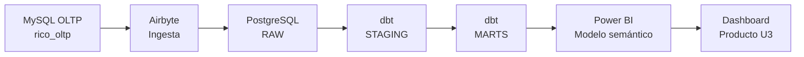

# Rico BI

## Producto BI end-to-end para Corporación Rico S.A.C.

**Rico BI** es una solución Business Intelligence construida para analizar ventas, rentabilidad, clientes, vendedores y cobranza. El proyecto integra una base transaccional, un proceso de ingesta, un Data Warehouse, transformaciones dbt, un modelo semántico y dashboards en Power BI.

---

## Enlaces principales

| Recurso               | Enlace                                                           |
| --------------------- | ---------------------------------------------------------------- |
| Repositorio GitHub    | [Abrir repositorio](https://github.com/EliasDemo/rico-bi)        |
| Documentación MkDocs  | [Abrir documentación](https://EliasDemo.github.io/rico-bi/)      |
| Dashboard Power BI U3 | `powerbi/rico_pollo_actualizado_U3.pbix`                         |
| Validación SQL U3     | `dw-dbt/rico_bi/rico_bi/analyses/validacion_comparativos_u3.sql` |

---

## Flujo general BI

---

## Componentes implementados

| Componente            | Estado     | Evidencia                                |
| --------------------- | ---------- | ---------------------------------------- |
| OLTP MySQL            | Completado | `oltp-mysql/`                            |
| DataMart manual MySQL | Completado | `dw-mysql/`                              |
| PostgreSQL DW         | Completado | `dw-pg/`                                 |
| Airbyte               | Completado | `ingesta-airbyte/`                       |
| dbt staging y marts   | Completado | `dw-dbt/`                                |
| Power BI base         | Completado | `powerbi/rico_pollo_actualizado.pbix`    |
| Power BI U3           | Completado | `powerbi/rico_pollo_actualizado_U3.pbix` |
| Validación SQL U3     | Completado | `validacion_comparativos_u3.sql`         |
| Trazabilidad U3       | Completado | Página `Trazabilidad U3`                 |
| Gobierno y hallazgos  | Completado | Página `Gobierno y hallazgos U3`         |
| Informe final U3      | Completado | Página `Informe final U3`                |

---

## Indicadores principales

| KPI                  |       Resultado |
| -------------------- | --------------: |
| Ventas facturadas    | S/ 605.83 mill. |
| Ventas netas sin IGV | S/ 513.42 mill. |
| Margen bruto         | S/ 154.18 mill. |
| % margen bruto       |         30.03 % |
| Monto pagado         | S/ 583.67 mill. |
| Saldo pendiente      |  S/ 22.16 mill. |
| % cobrado            |         96.34 % |
| DSO promedio         |      12.27 días |

---

## Comparativo U3 validado

Para enero de 2025, el dashboard **Comparativo U3** y la consulta SQL entregan los mismos resultados:

| Métrica             |         Resultado |
| ------------------- | ----------------: |
| Ventas actuales     |  S/ 17,189,473.94 |
| Ventas año anterior |  S/ 17,278,131.27 |
| Variación YoY       |     -S/ 88,657.33 |
| % YoY               |           -0.51 % |
| Ventas mes anterior |  S/ 30,390,295.52 |
| Variación MoM       | -S/ 13,200,821.58 |
| % MoM               |          -43.44 % |

!!! success "Estado del producto U3"
El producto BI cuenta con repositorio GitHub, documentación MkDocs, dashboard Power BI U3, validación SQL, trazabilidad, gobierno mínimo de datos, hallazgos e informe final.
